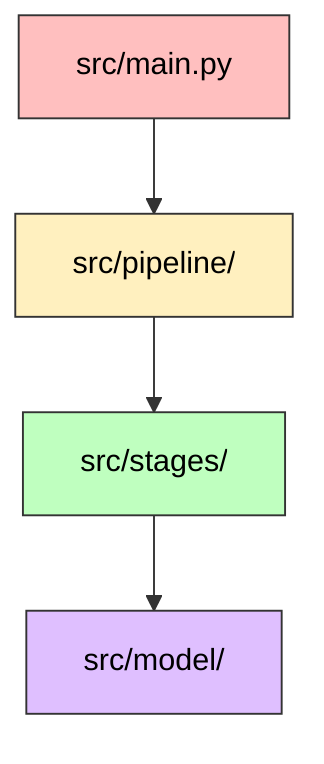

# 雑学ショート動画台本生成器 (Trivia Short Script Generator)

雑学テキストを元に、ショート動画制作に必要な台本や素材リストを Gemini API (Gemini 2.0 Flash) を活用して自動生成するツールです。

---

## 🚀 主な機能 (Key Features)

1.  **台本生成 (make_script)**: 雑学テキストから動画用のタイトルと基本台本を生成します。
2.  **キャラクター変換 (add_character_script)**: 台本を指定のキャラクター口調（例：ずんだもん）に変換します。
3.  **COEIROINK形式出力 (output_coeroink_txt)**: 音声合成ソフトでの読み上げ用に、文節ごとに改行を入れたテキストファイルを出力します。
4.  **画像リクエスト作成 (generate_img_request)**: 台本内容に基づき、動画編集で必要となる画像のリストを書き出します。
5.  **画像取得 (fetch_images)**: 画像リクエストに基づき、Pixabay 等から素材画像を自動取得します。
6.  **スライドショー生成 (generate_slideshow)**: 取得した画像と音声タイミングを合わせ、フェード効果付きのスライドショー動画を生成します。
7.  **最終動画合成 (generate_final_video)**: スライドショー、音声、字幕（中央配置）を統合した完成版動画を生成します。(※現在は使用していません)

## 🛠 使用技術 (Tech Stack)

| カテゴリ           | 技術                                                  |
| :----------------- | :---------------------------------------------------- |
| **Language**       | Python 3.12 (slim)                                    |
| **AI Model**       | Gemini 2.0 Flash (`gemini-2.0-flash-exp` 等)          |
| **Libraries**      | google-genai, pydantic, python-dotenv, pydub, moviepy |
| **Infrastructure** | Docker, Docker Compose                                |

## 🏁 はじめに (Getting Started)

### 前提条件 (Prerequisites)

- Docker / Docker Compose
- Gemini API Key

### セットアップ (Installation)

1.  **環境変数の設定**:
    プロジェクトルートに `.env` ファイルを作成し、以下の設定を行ってください。

    ```text
    GEMINI_API_KEY=your_gemini_api_key    # Gemini APIの利用に必須
    PIXABAY_API_KEY=your_pixabay_api_key  # 画像自動取得機能を使用する場合に必要
    USE_DUMMY_GEMINI=false               # テスト用にAPIを叩かずダミーを使用する場合は true
    ```

2.  **必要なディレクトリとファイルの準備**:
    以下のファイル・ディレクトリは `.gitignore` で除外されていますが、実行に必要です。手動で作成または配置してください。

    -   **プロンプトテンプレート (`src/prompts/`)**:
        AIへの指示文を格納します。以下のファイルが必要です。
        -   `make_script.txt`: 基本台本生成用
        -   `add_character_script.txt`: キャラクター口調変換用
        -   `output_coeroink_txt.txt`: COEIROINK形式整形用
        -   `generate_img_request.txt`: 画像リクエスト生成用
    -   **入力データ (`src/data/input/`)**:
        -   `trivia.txt`: 台本の元となる雑学テキスト（必須）
        -   `voice/`: 音声合成済みの素材を格納するディレクトリ
            -   `001_xxx.wav`, `001_xxx.txt` のような形式で、番号順に結合されます。
    -   **作業・出力用 (実行時に自動生成)**:
        -   `src/data/output/`: 各ステージの中間データや最終成果物が出力されます。
        -   `src/logs/`: Gemini APIとの通信ログが保存されます。

## 📖 使い方 (Usage)

Docker Composeを利用してパイプラインを実行します。

### 実行コマンド

```bash
docker-compose up --build
```

実行後、以下のファイルが生成されます：

- `data/output/coeroink.txt`: 改行済み台本テキスト
- `data/output/img_request.txt`: 必要な画像リスト

### コンテナ内での操作

```bash
# コンテナの中に入って直接実行する場合
docker-compose exec app bash
python main.py [コマンド]
```

### パイプライン実行 (`main.py`)

一連の自動化フロー（パイプライン）を実行するためのメインスクリプトです。

| コマンド            | 説明                                                                                                                             |
| :------------------ | :------------------------------------------------------------------------------------------------------------------------------- |
| `gen-script`        | 雑学テキストの読み込みから、ベース台本生成、キャラクター口調変換、COEIROINK形式出力までの全ステップを連続で実行します。          |
| `gen-video-footage` | 音声データ生成、字幕動画作成、画像リクエスト生成、画像取得、スライドショー生成までの一連の動画素材作成パイプラインを実行します。 |
| `gen-final-video`   | スライドショー生成、音声合成、中央字幕を統合した最終動画を一括生成します。(※現在は使用していません)                                                     |

### 個別ステージ実行 (`stage_runner.py`)

各処理（ステージ）を単独で個別に実行・テストするための手動実行用スクリプトです。

```bash
# 台本作成のみ実行
python stage_runner.py make-script

# 音声生成のみ実行
python stage_runner.py gen-voice

# 画像取得のみ実行
python stage_runner.py fetch-images

# スライドショー生成のみ実行
python stage_runner.py gen-slideshow
```

| 引数 (ステージ) | 説明                                                                                                                     |
| :-------------- | :----------------------------------------------------------------------------------------------------------------------- |
| `make-script`   | 入力テキスト(`data/input/trivia.txt`)からベースとなる台本(`make_script.json`)のみを生成します。                      |
| `add-char`      | 既存の台本データ(`make_script.json`)を元に、キャラクター口調の台本(`add_character.json`)のみに変換します。               |
| `coeroink`      | 既存のキャラクター台本データ(`add_character.json`)を元に、COEIROINK用テキストが出力されます。                            |
| `gen-voice`     | 録音済み音声ファイル(`data/input/voice/`)を結合し、音声(`voice.wav`)とメタデータ(`voice_data.json`)を生成します。   |
| `gen-img-req`   | 音声のメタデータ(`voice_data.json`)をもとに、画像リクエストJSONをGeminiで生成します。                                    |
| `fetch-images`  | 画像リクエスト(`img_request.json`)をもとに、Pixabayから画像をダウンロードし、画像リスト(`slide_imgs.json`)を生成します。 |
| `gen-slideshow` | 画像リスト(`slide_imgs.json`)をもとに、スライドショー動画(`slides.mp4`)を生成します。                                    |
| `gen-subtitle`  | 音声のメタデータ(`voice_data.json`)をもとに、字幕のみの動画(`subtitle.mp4`)を生成します。                                 |
| `gen-final-video`| スライドショー、音声、字幕を統合した最終動画(`final_video.mp4`)を生成します。(※現在は使用していません)                                           |

## 📂 ディレクトリ構成 (Directory Structure)

```text
.
├── src/
│   ├── main.py          # 実行エントリーポイント (CLI、各パイプラインの呼び出し)
│   ├── config.py        # パスやモデル設定などの全体定数
│   ├── pipeline/        # 一連の自動化フロー（オーケストレーション）
│   ├── stages/          # アトミックな各処理の実行単位（API通信、動画編集など）
│   ├── util/            # アプリ内共通機能（ロギング、ファイルIO、Geminiクライアント）
│   ├── model/           # Pydantic によるデータ構造定義 (レスポンス型など)
│   ├── data/            # 入力データおよび出力結果
│   ├── logs/            # Gemini API呼び出し時のプロンプトとレスポンスのログ
│   └── prompts/         # Gemini用プロンプトのテンプレート
├── Dockerfile           # Python環境定義
├── docker-compose.yml   # 開発環境設定
├── requirements.txt     # Python依存パッケージ
└── .env                 # 環境変数
```

### コンポーネント間の依存関係

プロジェクトの各ディレクトリ・モジュールは、責務ごとに明確に分離されており、以下のような依存関係を持っています。



1.  **`src/main.py` (CLI / Entrypoint)**
    - **役割**: ユーザーからのコマンド入力(`gen-script`, `gen-subtitle`等)を受け取り、適切なパイプラインを実行します。
    - **依存**: `src/pipeline/` (実行フローの呼び出し)
2.  **`src/pipeline/` (Orchestration)**
    - **役割**: 複数の処理(Stage)をつなぎ合わせ、I/Oを含めた一連の作業フローを定義します。
    - **依存**: `src/stages/` (アトミックな処理), `src/util/` (ファイル保存等)
3.  **`src/stages/` (Processing Functions)**
    - **役割**: Gemini APIによるテキスト生成や、MoviePyを用いた動画編集などのアトミックな機能を提供します。
    - **依存**: `src/model/` (型定義), `src/util/` (APIクライアント等)
    - **外部依存**: `moviepy`, `pydub`
4.  **`src/util/` (Utilities)**
    - **役割**: プロジェクト全体で使い回す汎用的な処理（APIクライアント初期化、ロギング、JSONの読み書き）をまとめます。
    - **外部依存**: `google-genai` (Gemini API呼び出し), `python-dotenv` (環境変数展開)
5.  **`src/model/` (Data Models)**
    - **役割**: APIの構造化出力や内部でやり取りするデータのスキーマを定義します。
    - **外部依存**: `pydantic`
