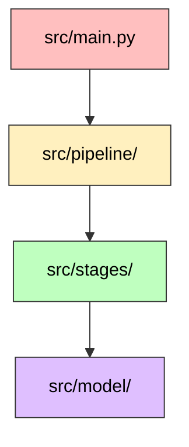

# 雑学ショート動画台本生成器 (Trivia Short Script Generator)

雑学テキストを元に、ショート動画制作に必要な台本や素材リストを Gemini API (Gemini 2.0 Flash) を活用して自動生成するツールです。

---

## 🚀 主な機能 (Key Features)

1.  **台本生成 (make_script)**: 雑学テキストから動画用のタイトルと基本台本を生成します。
2.  **キャラクター変換 (add_character_script)**: 台本を指定のキャラクター口調（例：ずんだもん）に変換します。
3.  **COEIROINK形式出力 (output_coeroink_txt)**: 音声合成ソフトでの読み上げ用に、文節ごとに改行を入れたテキストファイルを出力します。
4.  **画像リクエスト作成 (output_img_request)**: 台本内容に基づき、動画編集で必要となる画像のリストを書き出します。

## 🛠 使用技術 (Tech Stack)

| カテゴリ           | 技術                                                  |
| :----------------- | :---------------------------------------------------- |
| **Language**       | Python 3.12 (slim)                                    |
| **AI Model**       | Gemini 2.0 Flash (`gemini-2.0-flash-exp` 等)          |
| **Libraries**      | google-genai, pydantic, python-dotenv, pydub, moviepy |
| **Infrastructure** | Docker, Docker Compose                                |

## 🏁 はじめに (Getting Started)

### 前提条件 (Prerequisites)

- Docker / Docker Compose
- Gemini API Key

### セットアップ (Installation)

1.  **環境変数の設定**:
    プロジェクトルートに `.env` ファイルを作成し、APIキーを設定してください。

    ```text
    GEMINI_API_KEY=your_api_key_here
    ```

2.  **入力データの準備**:
    `src/input/trivia.txt` に、台本の元となる雑学テキストを記入します。

## 📖 使い方 (Usage)

Docker Composeを利用してパイプラインを実行します。

### 実行コマンド

```bash
docker-compose up --build
```

実行後、以下のファイルが生成されます：

- `src/output/coeroink.txt`: 改行済み台本テキスト
- `src/output/img_request.txt`: 必要な画像リスト

### コンテナ内での操作

```bash
# コンテナの中に入って直接実行する場合
docker-compose exec app bash
python src/main.py [コマンド]
```

### 利用可能なコマンド (`src/main.py`)

本ツールは複数の工程に分かれたコマンドライン・インターフェースを提供しています。目的に応じて以下のコマンドを使用してください。

| コマンド       | 引数 (オプション)  | 説明                                                                                                                                                                  |
| :------------- | :----------------- | :-------------------------------------------------------------------------------------------------------------------------------------------------------------------- |
| `gen-script`   | `all` (デフォルト) | 雑学テキストの読み込みから、ベース台本生成、キャラクター口調変換、COEIROINK形式出力までの全ステップを連続で実行します。                                               |
|                | `make-script`      | 入力テキストからベースとなる台本のみを生成します。                                                                                                                    |
|                | `add-char`         | 既存の台本データを元に、キャラクター口調の台本のみに変換します。                                                                                                      |
|                | `coeroink`         | 既存のキャラクター台本データを元に、COEIROINK用テキストのみを出力します。                                                                                             |
| `gen-subtitle` | (なし)             | 用意された音声ファイル(`src/data/input/voice/`)をもとに、結合音声とタイミングメタデータを生成し、さらにそのデータを使った字幕動画(`subtitle.mp4`)を一気に生成します。 |
| `gen-video`    | `gen-img-req`      | 音声のメタデータをもとに、動画内で必要となる「画像リクエスト」のリストをGeminiで生成します。                                                                          |

## 📂 ディレクトリ構成 (Directory Structure)

```text
.
├── src/
│   ├── main.py          # 実行エントリーポイント (CLI、各パイプラインの呼び出し)
│   ├── config.py        # パスやモデル設定などの全体定数
│   ├── pipeline/        # 一連の自動化フロー（オーケストレーション）
│   ├── stages/          # アトミックな各処理の実行単位（API通信、動画編集など）
│   ├── util/            # アプリ内共通機能（ロギング、ファイルIO、Geminiクライアント）
│   ├── model/           # Pydantic によるデータ構造定義 (レスポンス型など)
│   ├── data/            # 入力データおよび出力結果
│   ├── logs/            # Gemini API呼び出し時のプロンプトとレスポンスのログ
│   └── prompts/         # Gemini用プロンプトのテンプレート
├── Dockerfile           # Python環境定義
├── docker-compose.yml   # 開発環境設定
├── requirements.txt     # Python依存パッケージ
└── .env                 # 環境変数
```

### コンポーネント間の依存関係

プロジェクトの各ディレクトリ・モジュールは、責務ごとに明確に分離されており、以下のような依存関係を持っています。



1.  **`src/main.py` (CLI / Entrypoint)**
    - **役割**: ユーザーからのコマンド入力(`gen-script`, `gen-subtitle`等)を受け取り、適切なパイプラインを実行します。
    - **依存**: `src/pipeline/` (実行フローの呼び出し)
2.  **`src/pipeline/` (Orchestration)**
    - **役割**: 複数の処理(Stage)をつなぎ合わせ、I/Oを含めた一連の作業フローを定義します。
    - **依存**: `src/stages/` (アトミックな処理), `src/util/` (ファイル保存等)
3.  **`src/stages/` (Processing Functions)**
    - **役割**: Gemini APIによるテキスト生成や、MoviePyを用いた動画編集などのアトミックな機能を提供します。
    - **依存**: `src/model/` (型定義), `src/util/` (APIクライアント等)
    - **外部依存**: `moviepy`, `pydub`
4.  **`src/util/` (Utilities)**
    - **役割**: プロジェクト全体で使い回す汎用的な処理（APIクライアント初期化、ロギング、JSONの読み書き）をまとめます。
    - **外部依存**: `google-genai` (Gemini API呼び出し), `python-dotenv` (環境変数展開)
5.  **`src/model/` (Data Models)**
    - **役割**: APIの構造化出力や内部でやり取りするデータのスキーマを定義します。
    - **外部依存**: `pydantic`
