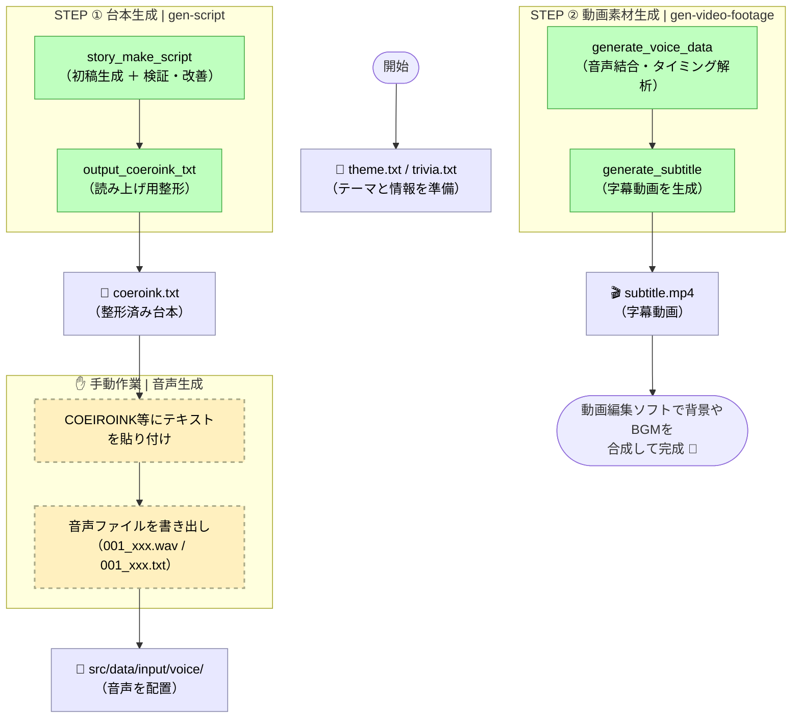

# 雑学ショート動画台本生成器 (Trivia Short Script Generator)

雑学データとテーマを元に、ショート動画制作に必要な台本や字幕素材を Gemini API を活用して自動生成するツールです。

---

## 🚀 主な機能 (Key Features)

1.  **台本生成 (gen-script)**: テーマと雑学テキストから、AIによる検証・改善工程を含めた高品質な台本を生成します。
2.  **読み上げ用整形**: 音声合成ソフト（COEIROINK等）での読み上げに最適な、文節区切りのテキストを出力します。
3.  **音声・字幕素材生成 (gen-video-footage)**: 手動で生成した音声ファイルを結合し、タイミングを解析して字幕付きの動画素材（オーバーレイ用）を生成します。

## 🛠 使用技術 (Tech Stack)

| カテゴリ           | 技術                                                  |
| :----------------- | :---------------------------------------------------- |
| **Language**       | Python 3.12 (slim)                                    |
| **AI Model**       | Gemini 3.1 Flash Lite (設定により変更可能)            |
| **Libraries**      | google-genai, pydantic, python-dotenv, pydub, moviepy |
| **Infrastructure** | Docker, Docker Compose                                |

## 🏁 はじめに (Getting Started)

### 前提条件 (Prerequisites)

- Docker / Docker Compose
- Gemini API Key

### セットアップ (Installation)

1.  **環境変数の設定**:
    プロジェクトルートに `.env` ファイルを作成し、以下の設定を行ってください。

    ```text
    GEMINI_API_KEY=your_gemini_api_key    # Gemini APIの利用に必須
    ```

2.  **必要なディレクトリとファイルの準備**:
    以下のファイル・ディレクトリは `.gitignore` で除外されていますが、実行に必要です。
    - **プロンプトテンプレート (`src/prompts/`)**:
      AIへの指示文を格納します。以下のファイルが必要です。
      - `story_make_script.txt`: 台本初稿生成用
      - `story_make_script_verify.txt`: 台本の検証・改善用
      - `output_coeroink_txt.txt`: COEIROINK形式整形用
      - `add_character_script.txt`: キャラクター口調変換用（個別実行用）
    - **入力データ (`src/data/input/`)**:
      - `theme.txt`: 動画のテーマ（例：「驚きの雑学」「意外な結末」など）
      - `trivia.txt`: 台本の元となる具体的な雑学情報
      - `voice/`: 手動で生成した音声素材（`.wav` と `.txt` のペア。例：`001.wav`, `001.txt`）を格納
    - **作業・出力用 (実行時に自動生成)**:
      - `src/data/output/`: 各ステージの最終成果物が出力されます。
      - `src/data/output/intermediate/`: 各工程の中間データ（JSON）が保存されます。

## 🔄 全体の実行フロー (Workflow Overview)

パイプラインは「台本生成」と「動画素材生成」の2フェーズに分かれています。



## 📖 使い方 (Usage)

### パイプライン実行 (`main.py`)

Dockerコンテナ内でメインの自動化フローを実行します。

```bash
# 台本生成パイプラインの実行
docker-compose run --rm app python main.py gen-script

# 動画素材（音源・字幕）生成パイプラインの実行
docker-compose run --rm app python main.py gen-video-footage
```

| コマンド | 説明 |
| :--- | :--- |
| `gen-script` | テーマと雑学から、検証済みの台本とCOEIROINK用テキストを生成します。 |
| `gen-video-footage` | 配置された音声素材から、結合音声(`voice.wav`)と字幕動画(`subtitle.mp4`)を生成します。 |

### 個別ステージ実行 (`stage_runner.py`)

特定の工程のみを個別にテストまたは実行する場合に使用します。

```bash
docker-compose run --rm app python stage_runner.py [ステージ名]
```

| ステージ名 | 説明 |
| :--- | :--- |
| `make-script` | 台本のみを生成します（初稿＋検証）。 |
| `add-char` | 既存の台本をキャラクター口調に変換します。 |
| `coeroink` | 台本を読み上げ用に整形します。 |
| `gen-voice` | 音声ファイルを結合し、タイミングデータを生成します。 |
| `gen-subtitle` | タイミングデータから字幕動画を生成します。 |

## 📊 生成データの説明

- **`data/output/coeroink.txt`**: 読み上げ用テキスト。タイトルとセリフが区切られて、実行のたびに追記されます。
- **`data/output/voice.wav`**: 全ての音声を結合した最終的な音声トラック。
- **`data/output/subtitle.mp4`**: 音声に同期したフルHDの字幕動画（オーバーレイ用）。
- **`data/output/intermediate/`**: 各工程で生成されるJSON形式のデータ。

## 📂 ディレクトリ構成

```text
.
├── src/
│   ├── main.py          # 実行エントリーポイント
│   ├── config.py        # 全体設定（モデル、パス、フォント設定等）
│   ├── pipeline/        # オーケストレーション
│   ├── stages/          # アトミックな各処理
│   ├── util/            # 共通ユーティリティ
│   ├── model/           # データ構造定義
│   ├── data/            # 入力・出力データ
│   └── prompts/         # プロンプトテンプレート
├── requirements.txt
└── .env
```
